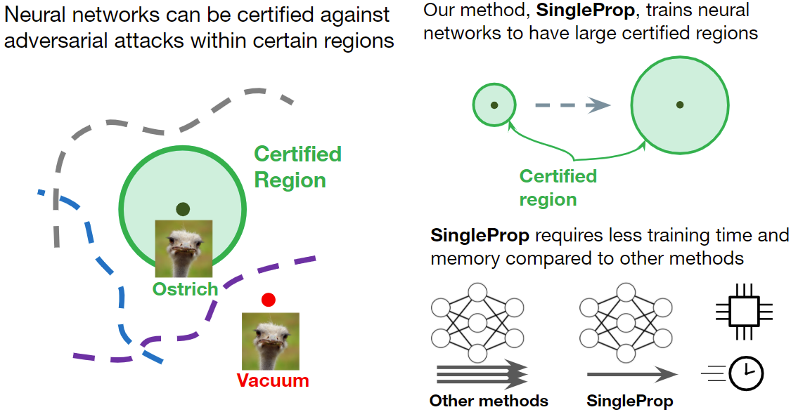

# SingleProp
## Overview
This repository contains the code for [Fast Training of Provably Robust Neural Networks by SingleProp](https://arxiv.org/pdf/2102.01208.pdf). In this work, we develop a new regularizer that is both more efficient than existing certified defenses, requiring only one additional forward propagation through a network, and can be used to
train networks with similar certified accuracy. Empirically, we find improvements in training speed and comparable certified accuracy compared to state-of-the-art certified defenses.



## Setup

1. The following packages are required.
```
pip install numpy numba tensorflow-gpu
```
For using the interval-bound-propagation library, Sonnet is also required:
```
pip install dm-sonnet
```
2. Clone this repository:

```
git clone https://github.com/AkhilanB/SingleProp.git
cd SingleProp
```


## How to Run
### Training
The function `train_singleprop` in `debug_cnn_train.py` can be used to train singleprop networks and certain baselines (standard, adversarial training, TRADES). To train all networks use:
```
python3 debug_cnn_train.py {n}
```
where {n} can be chosen to be 1 - 9. The choice of {n} trains the following networks:

1: MNIST Small, SingleProp

2: CIFAR Small, SingleProp

3: MNIST Medium, SingleProp

4: MNIST Wide, SingleProp

5: CIFAR Large, SingleProp

6: MNIST Small, standard + adversarial training + TRADES

7: MNIST Wide, standard + adversarial training

8: CIFAR Small, SingleProp, multiple seeds

9: MNIST Small, SingleProp, multiple seeds

IBP networks can be trained using the command line interface provided by `interval-bound-propagation/train.py`. The library is adapted from the adapted from the [source repository](https://github.com/deepmind/interval-bound-propagation). To train all IBP networks, run:
```
bash train_ibp.sh
```
### Certification
The function `certify` in `cnn_certify_ibp_tf.py` can be used to certify networks with IBP. To certify all networks use:
```
python3 cnn_certify_ibp_tf.py {n}
```
where {n} can be chosen to be 1 - 6. The choice of {n} certifies the following networks:

1: MNIST Small

2: CIFAR Small

3: MNIST Medium

4: MNIST Wide

5: CIFAR Large

6: Combined model certifications

The function `certify` in `cnn_certify.py` can be used to certify networks with linear bounding certifiers. To certify all networks use:
```
python3 cnn_certify.py
```

### Approximation error metrics
Run the following command to compute SingleProp approximation error metrics: 
```
python3 cnn_certify_ibp_tf.py 7
```

## Files
### Training files

Trains networks with singleprop and baselines: `cnn_train.py`
- Singleprop: `train_singleprop`
- TRADES: `train_trades`
- Adversarial training: `train_adv`
- Standard: `train_normal`
- IBP (alternate implementation): `train_ibp`
- Functions take network specification as list of filters, kernel sizes, strides, and paddings
- Parameters are set by passing functions (lr_val, K_val, eps_val) to the training functions which define the lr, K, eps at each step of training
- Saves networks to `networks/`

Trains networks with IBP: `interval-bound-propagation/train.py`
- Set model architecture with --model
- Set dataset with --dataset
- Choose adaptive hyperparameter selection with --reg=ada
- Saves networks to `interval-bound-propagation/networks/`

### Evaluation files

Certifies networks with ibp: `cnn_certify_ibp_tf.py`
- Main function is `certify`
- To certify combined networks use `certify_combined`
- To find approximation error metrics use `metrics`
- Functions take network file location, network specification as list of filters, kernel sizes, strides, and paddings and a list of perturbation sizes
- Certification functions return IBP certified accuracy for each perturbation size

Certifies networks with linear bounding certifiers: `cnn_certify.py`
- Main function is `certify`
- Specify the linear bounding certifier with `bnd_fn` which can be set to Fast-Lin: `relu_linear_bounds`, CROWN: `ada_linear_bounds`, Zero: `zero_linear_bounds`
- To certify with a combination of IBP and linear bounding certifiers, use  `certify_fastlinibp`
- Functions take network file location, network specification as list of filters, kernel sizes, strides, and paddings and a list of perturbation sizes
- Returns certified accuracy for each perturbation size

